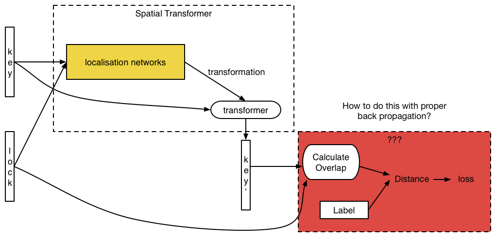

# Shape Overlap

I tried 3 localisation networks:

1. Siamese network
2. 2-Channel network
3. CNN with matching layer

Network 1,2 refer to [Learning to Compare Image Patches via Convolutional Neural Networks](http://www.cv-foundation.org/openaccess/content_cvpr_2015/papers/Zagoruyko_Learning_to_Compare_2015_CVPR_paper.pdf) and the architecture detail can be found in [Github](https://github.com/szagoruyko/cvpr15deepcompare)

Network 3 refer to the matching layer described in [Convolutional neural network architecture for geometric matching](https://arxiv.org/pdf/1703.05593.pdf)

However, there is some problem in implementing Overlap Calculation via Tensorflow. It can not be backpropagated with out a dummy node (which is useless for the model). But the loss doesn't descend with this dummy node.

### Loss Function

Denote the transferred key image as $K^\prime$, the lock image is $L$
$$
Loss =\frac{1}{n}\sum_n (\frac{A_{maxoverlap} - A_{overlap}}{A_{maxoverlap}})^2
$$
I regard $\frac{A_{overlap}}{A_{maxoverlap}}$ as the similarity.